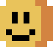
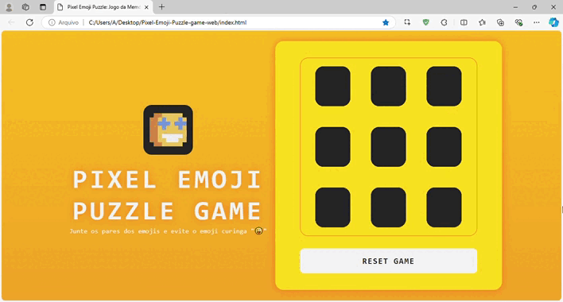

# Pixel Emoji Puzzle Game

*Pixel Emoji Puzzle Game* é um **game web de memória** com artes em **pixel art** feitas por mim. Desenvolvido com **HTML, CSS e JavaScript**, o objetivo do jogo é simples: combine as cartas com emojis, testando sua memória e agilidade, enquanto evita o emoji coringa "😜", que é um emoji extra que pode complicar sua missão. As cartas do jogo apresentam uma variedade de emojis criados por mim, proporcionando uma experiência única e personalizada. 

### Resultado

